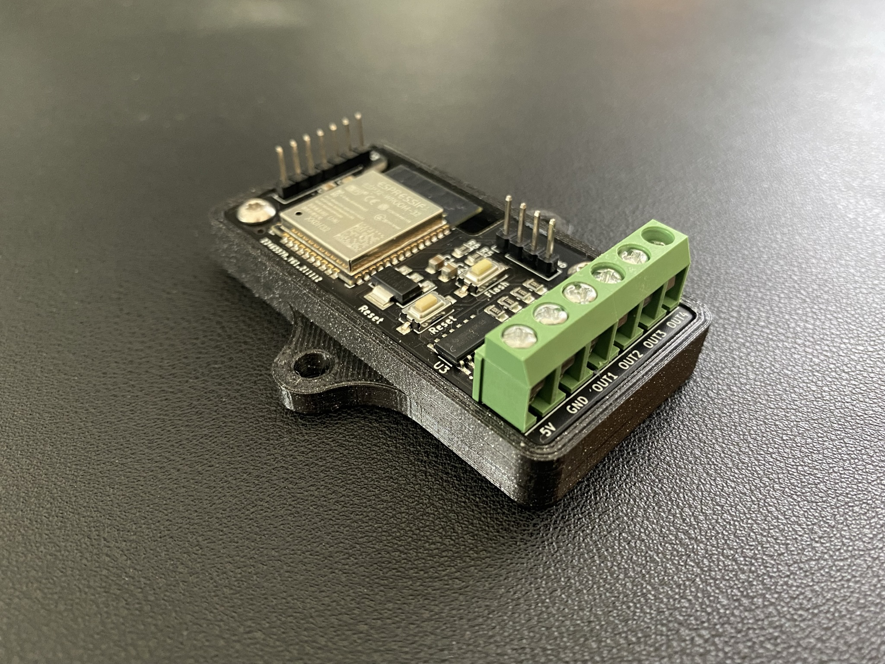
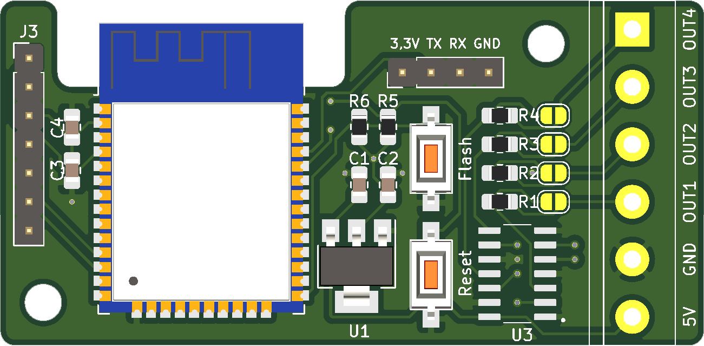
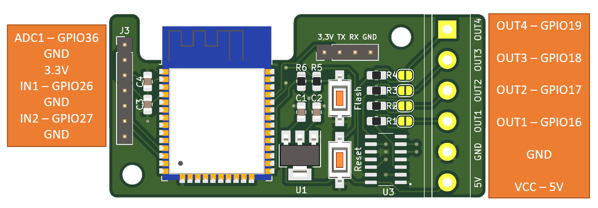

Shield: [![CC BY-NC-SA 4.0][cc-by-nc-sa-shield]][cc-by-nc-sa]

This work is licensed under a
[Creative Commons Attribution-NonCommercial-ShareAlike 4.0 International License][cc-by-nc-sa].

[![CC BY-NC-SA 4.0][cc-by-nc-sa-image]][cc-by-nc-sa]

[cc-by-nc-sa]: http://creativecommons.org/licenses/by-nc-sa/4.0/
[cc-by-nc-sa-image]: https://licensebuttons.net/l/by-nc-sa/4.0/88x31.png
[cc-by-nc-sa-shield]: https://img.shields.io/badge/License-CC%20BY--NC--SA%204.0-lightgrey.svg

# WLED ESP32 Controller
This board is designed to connect addressable LEDs/Neopixel strips and handle them with the WLED firmware. Other firmware can be used as well.

## Features
- 5V/GND connector for input voltage
- 4 output lines for LED data or relais
- level shifter for all 4 outputs (3.3V -> 5V )
- resistor for data lines
- support for LED strips with clock signal
- connector for microphone sensor or button input (ADC1, GND, 3.3V, IN1, GND, IN2, GND)
- connector to flash firmware with CP2104 (3.3V, TX, RX, GND)

## BOM
- 1 x WLED ESP32 Controller presoldered
    - C1, C3: 10µF 0805
    - C2: 47µF 0805
    - C4: 100nF 0805
    - R1, R2, R3, R4: 330 Ohm 0805
    - R5, R6: 10k Ohm 0805
    - SW1, SW2: SW-SMD-3.7x6.1_2P
    - U1: AMS1117-3.3 SOT-223-3
    - U2: ESP-WROOM-32
    - U3: SN74AHCT125DR
- 2 x 3-pin screw terminal (https://www.amazon.de/gp/product/B07PPRYT4X)
- 1 x 4-pin header male
- 1 x 7-pin header male

## Wiring diagram
- https://github.com/Hasenpups/WLED_ESP32_Controller_Public/blob/master/WLED_ESP32_Controller.pdf

## Software
- WLED: https://github.com/Aircoookie/WLED/releases
- Sound Reactive WLED: https://github.com/atuline/WLED/releases

## WLED configuration
- OUT1 - pin 16
- OUT2 - pin 17
- OUT3 - pin 18
- OUT4 - pin 19
- Microphone input - pin 36
- Button input 1 - pin 26
- Button input 2 - pin 27

## Case
- https://github.com/Hasenpups/WLED_ESP32_Controller/blob/master/Case/WLED_ESP32_Controller_Case.stl
